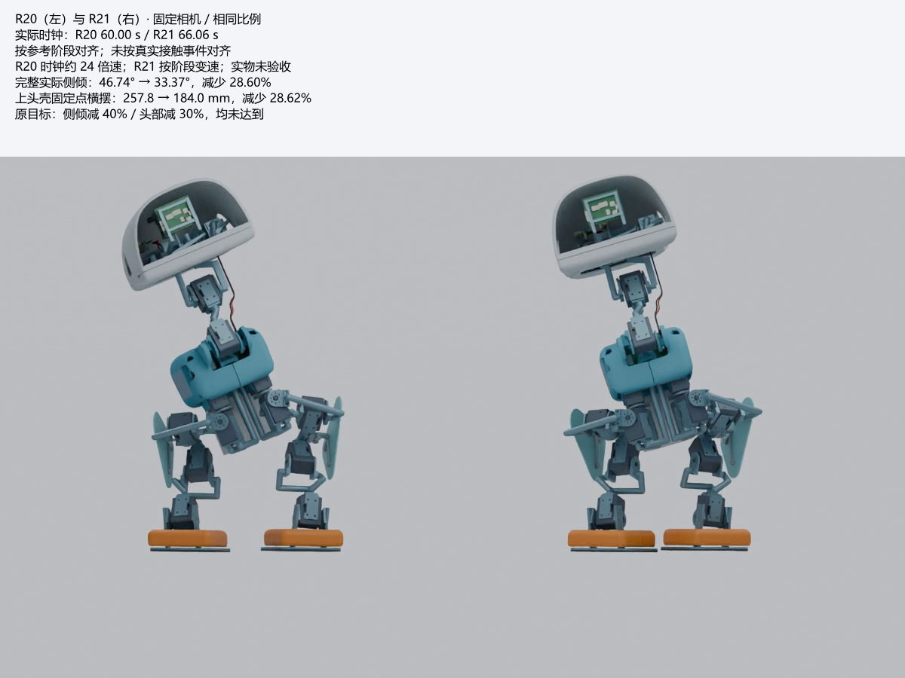

# OpenDuck · Microduck 工程

本仓库整理 Microduck 的结构、电气、步态数值验证，以及 RK3576 驱动和训练适配源。**当前是工程仿真预发布，尚未通过实物制造与正常步速行走验收。**

**本次更新：[R22紧凑电源候选](hardware/r22-candidate/README.md) · [模型与完整工程下载](https://github.com/ldcyes/OpenDuck/releases/tag/r22-compact-power-candidate-20260914)。**

| 范围 | 当前基线 | 已有结果与边界 |
|---|---|---|
| 结构与装配 | R20 / R13.7 | 557件，名义质量4.195094 kg；72对参考窄/未证、34对实际名义接口仍保留 |
| 运动 | R21 / R13.8 | 实际身体侧倾与上头壳固定点横摆均减少约28.6%；慢速四步195.44 s；四种数值工况通过，原40%/30%目标未达到 |
| 电气 | R13原生板图 | 12种、13块；原规则DRC为0；额外启用忽略规则仍有43项警告；6块PCB、U2D2及相机待详细安装 |
| 驱动、交互和训练适配 | 已交付R8软件 | 有源码与历史测试；没有RK3576实机运行、GPU训练、实测BAM和批准权重；未完成R20/R21重新适配验收 |

## 从这里开始

- [直接下载完整装配、原始交付包和视频](https://github.com/ldcyes/OpenDuck/releases/tag/r13.8-simulation-20260913)：模型可独立打开；全部大文件保留原始内容，仅采用方便下载的英文文件名。
- [12种KiCad板、原理图及BOM入口](docs/pcb/原生电气设计入口.md)：每板均含项目文件、本地符号库与封装库。
- [PCB功能与主要器件](docs/pcb/01_全部PCB功能与主要器件.md)、[DRC和尺寸结论](docs/pcb/00_PCB检查与缩板结论.md)、[43项警告复核](docs/pcb/02_43项警告逐对象复核.md)。
- [结构修订和完整装配说明](docs/structure-r20/00_修复结果与查看说明.md)、[减摆结果](docs/motion-r21/00_减摆结果与查看说明.md)、[模型与视频查看方法](docs/motion-r21/02_模型与视频查看说明.md)。
- [软件、部署和训练真实入口](docs/software.md)、[复算与来源校验](docs/reproduction.md)、[来源和许可](NOTICE.md)。

## 下载内容

| 文件 | 内容 | 大小（十进制MB） |
|---|---|---:|
| [R13.7结构包](https://github.com/ldcyes/OpenDuck/releases/download/r13.8-simulation-20260913/R13.7-structure-gait.zip) | 结构、图纸、装配模型、沿用源快照和验证结果 | 730.83 |
| [R13.8步态更新包](https://github.com/ldcyes/OpenDuck/releases/download/r13.8-simulation-20260913/R13.8-reduced-sway.zip) | 新步态、四工况结果、减摆对照、更新代码与原始索引 | 603.51 |
| [PCB完整检查包](https://github.com/ldcyes/OpenDuck/releases/download/r13.8-simulation-20260913/PCB-R13-review.zip) | 12种原生板图、BOM、本地库与检查证据 | 1.99 |
| [完整Blender装配](https://github.com/ldcyes/OpenDuck/releases/download/r13.8-simulation-20260913/Microduck-R21-actual-comparison.blend) | 内含全部零件和实际运动，可直接打开 | 66.22 |
| [实际四步视频](https://github.com/ldcyes/OpenDuck/releases/download/r13.8-simulation-20260913/R21-four-steps-24x.mp4) | 约24倍播放速度；原始物理时间195.44 s | 1.14 |
| [同阶段对照视频](https://github.com/ldcyes/OpenDuck/releases/download/r13.8-simulation-20260913/R20-R21-phase-comparison.mp4) | 对齐参考阶段的R20/R21可视化 | 1.45 |

大小和SHA256见 [release-assets.json](release-assets.json) 与 [SHA256SUMS.txt](SHA256SUMS.txt)。GitHub自动生成的“Source code”压缩包只包含本仓库，不包含上述大型交付包。

## 仓库布局

| 目录 | 用途 |
|---|---|
| [hardware/kicad](hardware/kicad) | R13原生板图及本地库，201个文件保留原字节 |
| [docs](docs) | 适合GitHub浏览的说明、图和PCB复核 |
| [software/r8](software/r8) | 已交付R8驱动、交互、训练适配、相机/VLA源码与原验证记录 |
| [reference/work](reference/work) | R20/R21精选原始脚本、核心结果和两版实际轨迹；完整依赖在Release |
| [provenance](provenance) | 原始来源索引、复制哈希和文档路径转换记录 |
| [tools](tools) | 便携的仓库/附件校验和减摆复算入口 |
| [licenses](licenses) | 按来源分别保留的许可及上游说明 |

## 当前限制

正式四步从已经检查的新准备站姿开始；站姿过渡候选没有同等级完整验证。没有完成正常步速、温升、低电量持续扭矩或实物验收，也没有据此放行所有装配间隙。待安装件已有估算质量，实际安装时须替换，不能重复计重。

R8软件保留其原profile、限位、策略及标定门禁。代码、模拟输入测试和61→14策略接口均不能替代新机械结构的实测标定或批准策略。软件入口默认使用未批准模板或dry-run，当前资料不构成上机运动许可。

项目派生自 Pollen Robotics 的 Microduck。软件、模型、KiCad库和Linux参考源码的许可分别见 [NOTICE.md](NOTICE.md)；本仓库没有给不明第三方资料统一增加商业许可。

## R22 紧凑电源候选（独立预发布）

[R22工程入口](hardware/r22-candidate/README.md)提供新的52×42 mm入口板、舵机电源与回生阶梯合板、原生KiCad/原理图/本地库、Gerber/钻孔和实际安装CAD。本次三个旧板改为两个候选板，总板面积减少14.01%；两块候选的冻结ERC/DRC及额外检查为0。原R13十二种板与R20/R21基线资料继续保留。

新增几何对原R21轨迹关节范围的93,595个动态配对满足≥2.2 mm的保守间隙证据；完整模型为733项装态几何/包络，并非733件制造BOM。这是几何复核，尚未按R22质量重新求解步态，也没有样机制造、温升、回生或行走验收。合板到机身主支架、完整线束及热连接仍需闭合。

- [R22独立预发布](https://github.com/ldcyes/OpenDuck/releases/tag/r22-compact-power-candidate-20260914)：[完整工程ZIP](https://github.com/ldcyes/OpenDuck/releases/download/r22-compact-power-candidate-20260914/R22-engineering-candidate.zip)、[可独立打开的静态Blender装配](https://github.com/ldcyes/OpenDuck/releases/download/r22-compact-power-candidate-20260914/Microduck-R22-static-candidate.blend)、[两板制造与检查包](https://github.com/ldcyes/OpenDuck/releases/download/r22-compact-power-candidate-20260914/R22-PCB-review.zip)、[SHA256](https://github.com/ldcyes/OpenDuck/releases/download/r22-compact-power-candidate-20260914/SHA256SUMS.txt)。
- [入口板安装](hardware/r22-candidate/mechanics/entry_mount/README.md)、[电容托架最终组合](hardware/r22-candidate/mechanics/motion_delta/CAP_FINAL_SUPPLEMENT.md)、[制造与验收边界](hardware/r22-candidate/fabrication/README.md)。
- [原始来源映射](provenance/r22-source-mapping.json)、[文档路径转换](provenance/r22-document-path-conversions.json)、[Git副本校验](provenance/r22-publication-file-check.json)、[附件摘要](provenance/r22-release-assets.json)。GitHub自动生成的Source code包不含完整工程ZIP和Blender。

R22没有更新RK3576驱动接口、保护阈值或批准训练权重；软件仍以既有R8真实入口及其未验收范围为准。来源和分别适用的许可继续见[NOTICE](NOTICE.md)。
