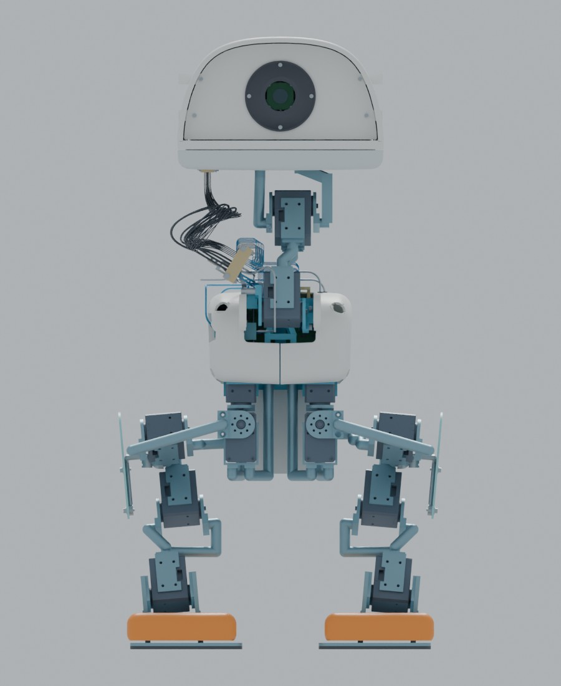
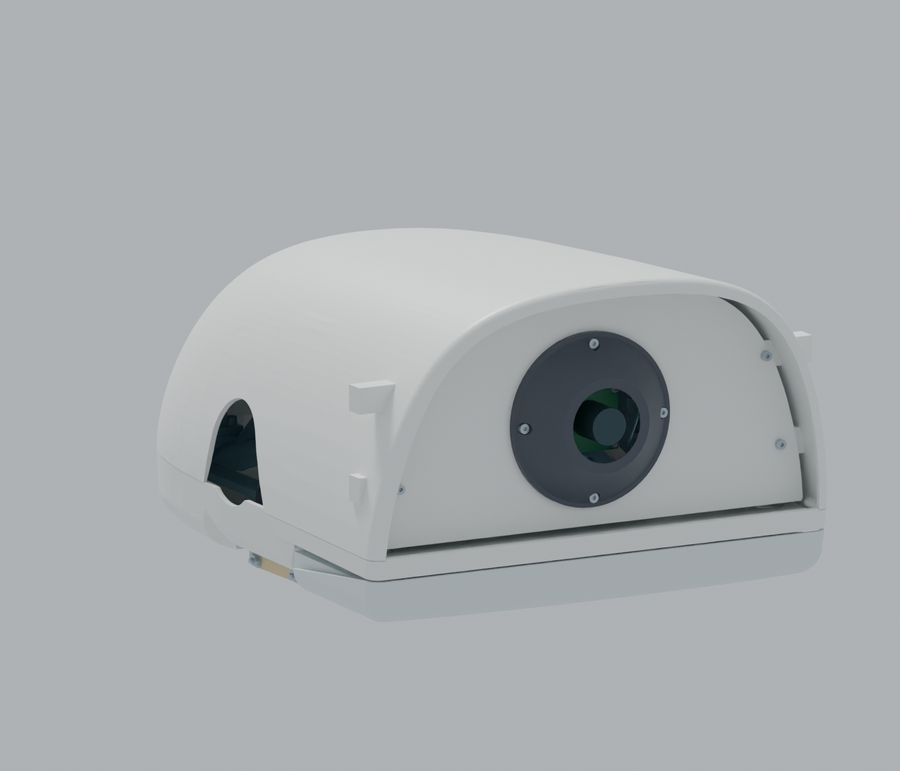

# OpenDuck Engineering

[简体中文](README.md) | **English**

OpenDuck brings together mechanical design, electronics, numerical gait studies, and RK3576 runtime and training adaptation sources derived from Microduck. **This is an engineering simulation prerelease. Physical fabrication and normal-speed walking acceptance have not been completed.**

**Latest assembly: [R26 cover-first option A](hardware/r26-cover-first/README_EN.md) · [Complete Blender and engineering downloads](https://github.com/ldcyes/OpenDuck/releases/tag/r26-cover-first-20260924).**

The 31 head conductors now enter from below. R25 retains the camera front cover and existing body proportions, uses a more compact moving harness, and closes the former dedicated side cable window. See the [bottom-entry detail](hardware/r25-bottom-head-entry/images/03-bottom-head-entry.png). The separate motor access opening remains in the published R25 shell; its permanent closure is a subsequent design decision. Discrete head-pose checks do not establish continuous-motion or physical acceptance.

**Design review, September 24:** [leg proportions and actuator screening](docs/proportion-study-20260924/README_EN.md). The earlier review compares alternatives. R26 now implements option A with shorter covers; leg lengths and actuator selection remain unchanged.

The [R24 camera cover](hardware/r24-head-front/README.md), [R23 integrated power-board mount, harness and thermal design](hardware/r23-design/README.md), and their historical releases remain available. [Download the complete R23 engineering package](https://github.com/ldcyes/OpenDuck/releases/tag/r23-integrated-power-design-20260922).

| Area | Earlier baseline | Results and limits |
|---|---|---|
| Structure and assembly | R20 / R13.7 | 557 parts, nominal mass 4.195094 kg; 72 reference pairs with narrow or unproven clearance and 34 actual nominal interfaces remain recorded |
| Motion | R21 / R13.8 | Actual body roll and lateral motion of a fixed point on the upper head shell reduced by about 28.6%; four slow steps take 195.44 s; four numerical cases passed their recorded criteria; original 40%/30% reduction targets were not achieved |
| Electronics | Native R13 board designs | 12 board types, 13 installed boards; original-rule DRC reported zero violations; enabling additional ignored rules produced 43 warnings; detailed installation of six PCBs, U2D2 and the camera was pending at this baseline |
| Runtime, interaction and training | Delivered R8 software | Source and historical tests are included; no RK3576 hardware run, GPU training, measured BAM calibration, approved weights, or completed R20/R21 software requalification |

Later R22–R25 integration work supplements this table. Do not treat results from different mechanical revisions as one validated robot.

## Start here

- [Complete assemblies, original delivery packages and videos](https://github.com/ldcyes/OpenDuck/releases/tag/r13.8-simulation-20260913). Blender assemblies can be opened independently; large original deliverables use English download filenames.
- [Native KiCad projects, schematics and BOMs](docs/pcb/原生电气设计入口.md). Each board includes its project and local symbol/footprint libraries.
- [All PCB functions and principal components](docs/pcb/01_全部PCB功能与主要器件.md), [DRC and board-size review](docs/pcb/00_PCB检查与缩板结论.md), and [review of the 43 warnings](docs/pcb/02_43项警告逐对象复核.md).
- [Structural revisions and assembly guide](docs/structure-r20/00_修复结果与查看说明.md), [reduced-sway results](docs/motion-r21/00_减摆结果与查看说明.md), and [model/video viewing guide](docs/motion-r21/02_模型与视频查看说明.md).
- [Runtime, deployment and training entry points](docs/software.md), [reproduction and source checks](docs/reproduction.md), and [sources and licenses](NOTICE.md).

Most detailed engineering documents are currently in Chinese. This English overview points to the same source files and preserves their qualification boundaries.

## Downloads

| File | Contents | Size, decimal MB |
|---|---|---:|
| [R13.7 structure package](https://github.com/ldcyes/OpenDuck/releases/download/r13.8-simulation-20260913/R13.7-structure-gait.zip) | Structures, drawings, assembly, retained source snapshot and verification records | 730.83 |
| [R13.8 gait update](https://github.com/ldcyes/OpenDuck/releases/download/r13.8-simulation-20260913/R13.8-reduced-sway.zip) | Updated gait, four numerical cases, sway comparison, code and original index | 603.51 |
| [Complete PCB review](https://github.com/ldcyes/OpenDuck/releases/download/r13.8-simulation-20260913/PCB-R13-review.zip) | 12 native board types, BOMs, local libraries and check evidence | 1.99 |
| [Complete Blender assembly](https://github.com/ldcyes/OpenDuck/releases/download/r13.8-simulation-20260913/Microduck-R21-actual-comparison.blend) | All components and actual simulated motion; opens independently | 66.22 |
| [Four-step video](https://github.com/ldcyes/OpenDuck/releases/download/r13.8-simulation-20260913/R21-four-steps-24x.mp4) | Approximately 24× playback; physical simulation time is 195.44 s | 1.14 |
| [Phase comparison video](https://github.com/ldcyes/OpenDuck/releases/download/r13.8-simulation-20260913/R20-R21-phase-comparison.mp4) | R20/R21 visualization aligned by reference gait phase | 1.45 |

Sizes and hashes are recorded in [release-assets.json](release-assets.json) and [SHA256SUMS.txt](SHA256SUMS.txt). GitHub's automatically generated “Source code” archives contain the repository, not the large release attachments above.

## Repository layout

| Directory | Purpose |
|---|---|
| [hardware/kicad](hardware/kicad) | R13 native boards and local libraries; 201 files preserved byte-for-byte |
| [docs](docs) | Browsable engineering notes, illustrations and PCB reviews |
| [software/r8](software/r8) | Delivered R8 runtime, interaction, training adaptation, camera/VLA sources and original verification records |
| [reference/work](reference/work) | Selected R20/R21 scripts, core results and actual trajectories; full dependencies are in the release packages |
| [provenance](provenance) | Source indexes, copy hashes and documentation path conversion records |
| [tools](tools) | Portable publication/attachment checks and sway-recalculation entry points |
| [licenses](licenses) | Separate upstream licenses and attribution |

## Current limitations

The four-step sequence starts from the checked preparation stance. The transition into that stance has not received the same complete validation. Normal walking speed, temperature rise, low-battery sustained torque, physical acceptance and all assembly clearances remain unqualified. Estimated masses for parts awaiting detailed installation must be replaced by their actual installed masses, without double-counting.

The R8 software retains its original profiles, limits, policies and calibration gates. Source code, synthetic-input tests and the 61-to-14 policy interface do not replace measured calibration and approved policies for a new mechanical revision. Entry points default to unapproved templates or dry runs. These materials do not authorize physical motion.

OpenDuck derives from Pollen Robotics' Microduck. Software, models, KiCad libraries and Linux reference sources have separate licenses listed in [NOTICE.md](NOTICE.md). This repository does not assign a blanket commercial license to third-party materials with unclear terms.

## R22 compact-power candidate

The [R22 engineering entry](hardware/r22-candidate/README.md) provides a 52 × 42 mm input board, a stepped combined servo-power/regeneration board, native KiCad projects and schematics, local libraries, Gerbers, drill files and mounting CAD. Three former boards become two candidate boards, reducing their total area by 14.01%. Frozen ERC/DRC and additional checks reported zero findings for both candidates. Original R13 boards and R20/R21 baseline materials are retained.

The new geometry has conservative clearance evidence of at least 2.2 mm over 93,595 dynamic pairs within the recorded R21 joint ranges. The complete model has 733 installed geometry/envelope entries, not 733 manufacturing BOM parts. These are geometry checks: the gait was not re-solved for R22 mass, and fabrication, thermal, regeneration and walking acceptance were not performed. Later integration is documented in [R23](hardware/r23-design/README.md), with its own physical acceptance limits.

- [R22 prerelease](https://github.com/ldcyes/OpenDuck/releases/tag/r22-compact-power-candidate-20260914): [engineering ZIP](https://github.com/ldcyes/OpenDuck/releases/download/r22-compact-power-candidate-20260914/R22-engineering-candidate.zip), [standalone static Blender assembly](https://github.com/ldcyes/OpenDuck/releases/download/r22-compact-power-candidate-20260914/Microduck-R22-static-candidate.blend), [two-board fabrication/review package](https://github.com/ldcyes/OpenDuck/releases/download/r22-compact-power-candidate-20260914/R22-PCB-review.zip), and [SHA256](https://github.com/ldcyes/OpenDuck/releases/download/r22-compact-power-candidate-20260914/SHA256SUMS.txt).
- [Input-board mount](hardware/r22-candidate/mechanics/entry_mount/README.md), [final capacitor cradle](hardware/r22-candidate/mechanics/motion_delta/CAP_FINAL_SUPPLEMENT.md), and [fabrication/acceptance boundaries](hardware/r22-candidate/fabrication/README.md).
- [Source mapping](provenance/r22-source-mapping.json), [path conversions](provenance/r22-document-path-conversions.json), [publication copy verification](provenance/r22-publication-file-check.json), and [release attachment index](provenance/r22-release-assets.json).

R22 did not update RK3576 runtime interfaces, protection thresholds or approved training weights. The delivered R8 software and its unqualified scope remain the reference.
