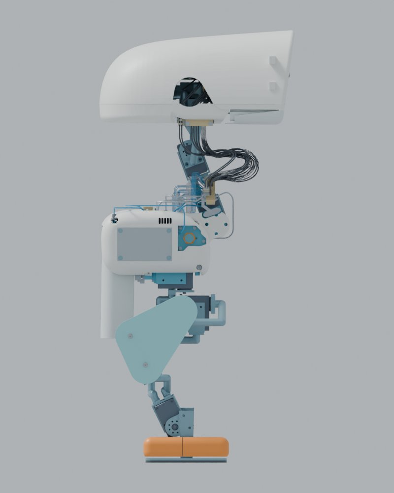

# 腿部比例与电机筛选：2026-09-24

[English](README_EN.md) · [返回首页](../../README.md)

**状态：设计比较，尚未修改制造结构、执行器BOM或批准步态。610 mm不是设计目标。** 用户已要求改善腿部比例，并允许必要时增加高度；应先消除遮挡，再判断实际腿长和电机尺寸，不把整机等比例放大作为默认办法。已选择的鸭头左侧孔永久闭合方案继续有效，但不在本次只读测量中假装完成。

## 当前模型的实测结果

测量源是R25完整Blender装配，核验其SHA256后，按逐件实际顶点和装配矩阵计算包络。排除默认隐藏的服务参考。另将R21准备站姿应用到R25几何，只用于比较尺寸；这不是R25步态或稳定性验证。

| 项目 | 结果 |
|---|---:|
| 装配中可见几何项 | 1,151 |
| HOME装配姿态全高 | 570.393 mm |
| 套用R21准备站姿后的全高 | 577.830 mm |
| 左大腿：髋俯仰至膝轴的三维距离 | 88.599 mm |
| 左小腿：膝至踝轴的三维距离 | 103.732 mm |
| 两段轴间距之和 | 192.331 mm |
| HOME髋至踝的垂直距离 | 157.400 mm |
| 左大腿覆盖件侧面X/Z包络 | 108.638 × 116.969 mm |
| 覆盖件下缘低于膝轴 | 27.224 mm |
| R25工程质量估计 | 4.447479 kg |
| R21四工况动力学模型质量 | 4.195094 kg |

轴间距包含横向偏置和屈膝方向，不能直接解释为腿的可见高度。侧面覆盖件下缘超过膝轴27.2 mm，与“腿短”的视觉感受有关，但这个投影测量不是可见像素遮挡面积，也不是碰撞间隙。

[正交正视](baseline-front.jpg)。两张图保持原装配HOME姿态，不使用倾斜相机来判断比例。

## 三种方案

| 方案 | 轴间距合计 | HOME高度估计 | 相同准备关节角下高度估计 | 取舍 |
|---|---:|---:|---:|---|
| A，优先重画覆盖件 | 192.33 mm | 570.39 mm | 577.83 mm | 优先建议；不增加腿部力臂，但实际腿长不变 |
| B，腿段矢状面分量加10% | 209.23 mm | 586.13 mm | 594.30 mm | 腿部确实变长，需要新连杆、安装件、线束与步态 |
| C，腿段矢状面分量加15% | 217.74 mm | 594.00 mm | 602.53 mm | 外观变化更明显，载荷与结构重做范围更大 |

B/C只放大髋—膝及膝—踝向量的X、Z分量，保持各轴HOME横向位置，避免连髋宽一起放大。由于Y分量保留，三维轴间距的增幅不等于10%或15%。表中高度是同关节角、同脚部偏置下的运动学估计；包含新支架、电机、脚底接触和最终站姿后的高度仍须重新确定。脚部横向落点也可能随关节旋转改变，不能沿用旧接触多边形。

A方案的具体设计目标：将覆盖件下缘由膝轴下27.2 mm收至约10 mm，理论上收回17.2 mm的垂直遮挡；保留原曲面语言，重新设计圆滑下缘。覆盖件侧向内收先以4 mm作为检查候选，重做对应支座，不能仅平移装配件。必须核对两颗外壳螺钉、垫圈、螺母、孔边距、工具通道和膝关节连续扫掠后再确定实际轮廓。当前包络测得壳内侧与髋俯仰电机最外点的Y向差约11.27 mm，只是筛选参考，不能作为全程净空。

## 电机筛选

R25实际清单为12个XM430、3个XC330；腿部10个关节均为XM430。所有商品电机必须使用厂家真实尺寸与接口，不能把电机网格按外观缩小。

| 型号 | 厂家尺寸W×H×D | 质量 | 11.1 V堵转扭矩 | 本次判断 |
|---|---|---:|---:|---|
| XM430-W350-T | 28.5×46.5×34 mm | 82 g | 3.8 N·m | 现有承重关节比较基线；持续能力尚未实测 |
| XM335-T323-T | 19×35×22 mm | 27 g | 1.03 N·m | 更小候选；优先研究头俯仰及髋偏航，不能直接替换髋俯仰、膝、踝 |
| XC330-T181-T | 20×34×26 mm | 23 g | 0.76 N·m | 保留头偏航、头滚转、嘴部候选用途，不升级为腿部承重电机 |
| XM540-W270-T | 33.5×58.5×44 mm | 165 g | 10.0 N·m | 更大、更重；四个髋俯仰/膝电机替换至少增加332 g，不含新支架，不作为改善腿部纤细比例的首选 |

规格核对日期2026-09-24；来源：[XM430](https://emanual.robotis.com/docs/en/dxl/x/xm430-w350/)、[XM335](https://emanual.robotis.com/docs/en/dxl/x/xm335-t323/)、[XC330](https://emanual.robotis.com/docs/en/dxl/x/xc330-t181/)、[XM540](https://emanual.robotis.com/docs/en/dxl/x/xm540-w270/)。表中是堵转值，不能作为低电量持续扭矩。XM335和XC330的最高输入电压为12.0 V，也不能未经电源范围核查便接入XM430允许的14.8 V总线。

对现有R21四种工况取每关节的最大绝对峰值及最大RMS，再取左右腿较大值：

| 关节组 | 历史峰值N·m | 历史RMS N·m | 当前判断 |
|---|---:|---:|---|
| 髋偏航 | 0.410 | 0.182 | XM335可研究，尚不能按堵转值定型 |
| 髋侧倾 | 0.825 | 0.493 | 不直接缩小 |
| 髋俯仰 | 1.175 | 0.527 | 不直接缩小 |
| 膝 | 1.043 | 0.690 | 不直接缩小 |
| 踝 | 0.807 | 0.459 | 不直接缩小 |
| 颈俯仰 | 0.499 | 0.402 | 长时间负载较高，暂保留XM430 |
| 头俯仰 | 0.210 | 0.108 | 可优先研究小电机，但新头盖、相机和线束负载必须重算 |

这些负载来自4.195 kg的旧模型，不能直接证明4.447 kg的R25适用。每个XM430换成XM335的电机本体减重55 g；仅头俯仰为55 g，连同两个髋偏航则为165 g，但均未计安装支架差额，也没有完成持续扭矩、电压、回差或径向载荷验证。

## 为什么现在不直接拉长或换大电机

R25比R21动力学模型的质量高6.02%。作为一阶敏感性筛选，将旧峰值乘以质量比，再乘矢状面长度系数；如要求15%容量余量，则以该筛选峰值除以0.85。原长度下髋俯仰约需1.465 N·m，B方案约1.612 N·m，C方案约1.685 N·m。旧模型对该关节使用的1.35 N·m本身也只是未实测的能力假设。

这不是新结构的逆动力学结果或保守上界；质量分布、接触力分配、角加速度和新电机惯量会改变实际需求。因此筛选只能指出“不能按旧结论直接放行”，不能证明任何候选已经足够或必然不足。

## 下一阶段设计与验收输入

1. 先评审A的覆盖件轮廓；若仍需实际加长，优先B，C保留为对照。610 mm不作为约束或承诺。
2. 选定方案后，同步更新真实电机/支架、连杆、固定五金和完整线束，不只修改显示网格。
3. 按最终装配更新质量、重心和惯量；对准备、单脚支撑、摆腿、转向和停止动作求解接触与动态负载，输出峰值、RMS、持续时间及转速。
4. 对低电量端电压、最不利环境温度与目标1–2小时工作周期制定持续/周期负载台架验收；保留15%容量余量定义。持续能力必须由厂家适用曲线或实测支撑。
5. 连续碰撞检查覆盖腿部外壳、连杆、电机、所有五金、脚部和线束，并检查公差和装配工具通道。独立检查曲面闭合、壁厚、打印导出、装配坐标与接口。
6. 头部B方案仍需完成曲面闭合及新增干涉复核。旧下壳/嘴部约8.75°起的冲突继续列为未闭合项，不能因去掉侧孔而隐藏。

本次完成的是测量与方案筛选，尚无新腿部STL/STEP、装配Blender、电机最终采购定型或实物测试结论。

## 证据与复算

- [逐件测量与源文件哈希](baseline_measurements.json)
- [三方案坐标、四工况负载与敏感性结果](candidate_screen.json)
- [测量源程序](measure_baseline.py)、[筛选源程序](compare_candidates.py)

源程序需放回完整工程根目录的`work/r26-proportion-study/`运行，依赖R25完整装配、R21准备站姿/四工况报告及R11运动学源；此Git仓库不是全部依赖的副本。运行入口：`work/tools/blender/blender --background --factory-startup --python work/r26-proportion-study/measure_baseline.py`，然后`python3 work/r26-proportion-study/compare_candidates.py`。输入的原始工程路径及SHA256记录在JSON内。图和输出为几何/数值设计资料，不是实物照片。
