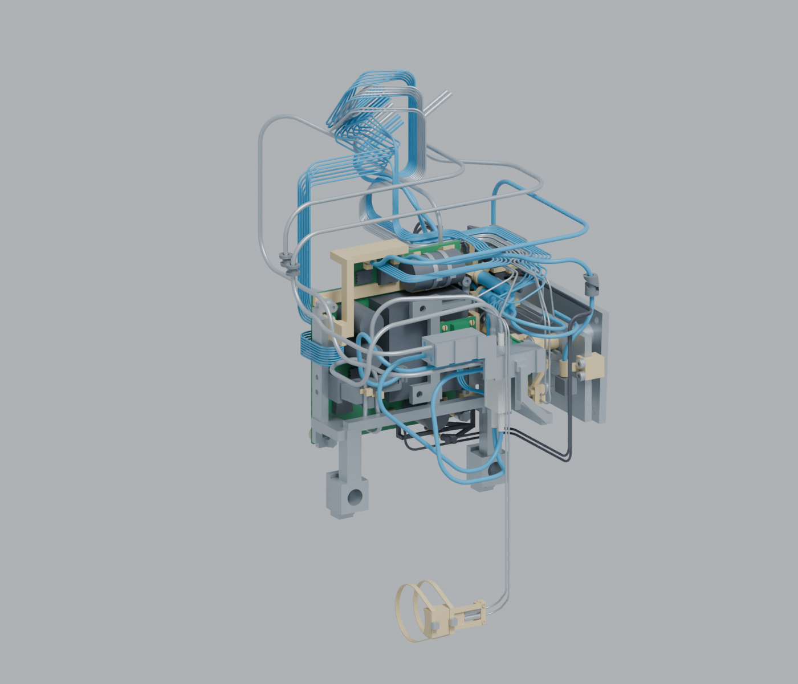

# R23 合板主支架、线束与热连接

本次把 R22 紧凑电源板接入现有 RK3576 机器人，补齐主支架、完整端接与固定、风道和导热结构。**工程设计评审预发布；没有样机制造、低电量持续扭矩、温升或行走验收。**

[完整工程 ZIP](https://github.com/ldcyes/OpenDuck/releases/download/r23-integrated-power-design-20260922/R23-engineering-design.zip) · [完整 Blender 模型](https://github.com/ldcyes/OpenDuck/releases/download/r23-integrated-power-design-20260922/Microduck-R23-integrated-design.blend) · [附件 SHA256](https://github.com/ldcyes/OpenDuck/releases/download/r23-integrated-power-design-20260922/SHA256SUMS.txt)

模型包含1189个装配对象和17个非装机工具/自由态参考，可逐件选择、隐藏 PCB、结构、电机和线束。场景01看整机，02看主支架与热连接，03看线束。对象数含子线段和器件包络，不等于制造BOM数量。

## 图册与验证

- [整机预览](images/01-complete-assembly.png)
- [线束预览](images/03-wiring.png)
- [主支架尺寸、截面与载荷图册](documents/main-bracket-dimensions-and-load.pdf)
- [后载体尺寸、安装与工具通道](documents/rear-mount-dimensions-and-assembly.pdf)
- [后载体载荷与预紧条件](documents/rear-mount-load-review.pdf)
- [线束工艺基础图册（改线行以最终补充图页和总表为准）](documents/harness-process-base.pdf)
- [全部装配对象及制造文件索引（路径对应完整 ZIP）](documents/part-catalog.csv)
- [最终59行综合裁线表](documents/complete-conductor-cut-table.csv)
- [改线与综合裁线补充图册](documents/dynamic-wire-corrections-and-cut-table.pdf)
- [H05嘴部避让与补强尺寸图](documents/h05-mouth-relief-dimensions.svg)
- [最终数值勘误与资料优先级](documents/final-errata.md)
- [W1铜损与热预算敏感性](documents/w1-copper-heat-sensitivity.md)
- [最终质量、重心及后载体载荷补充（覆盖旧图册载荷输入）](documents/final-rear-load-rebind.md)

ZIP中保持原始工程路径。唯一当前选择是 `work/r23-power-integration/integration/assembly_selection.json`（SHA256 `a9df66c72faf49bd74b2c5047ffddb117d498ca943c228e131047d6c2ce29ff0`）；历史候选和追溯文件不应叠加制造。网格打印主文件、STEP与逐件资料索引都在完整ZIP中。自由线HOME外形用于查看，按完整裁线表和工装制造。

## 当前结论

- 主支架按230g局部附件上限、上轨200g及规定重心盒检查；后载体采用独立7075适配件、PEEK件和低头螺钉，附装配/工具通道及预紧条件。指定截面计算不替代整件实物受载验证。
- 线束包含59条新增或修改电路、157条端到端关系；其余98条沿用，未宣称重新制作或实测。电芯正极至首保险丝98.473452mm工程预算保留已批准100mm上限及首件验收条件。
- W1、S03回弯及H05嘴部支架已修正；三件对整机其余刚体的2077组动态关系达到2.2mm检查目标。裁线使用最终59行总表和补充图册：W1为129±1mm，S03整根为665±1mm。原14页工艺图册对应旧行已被替代。
- 整体增量动态检查有244493/244494对达到2.2mm；剩余上头壳／嘴托继承表面约1.40mm，仍低于目标。H05与固定cradle的0.502710mm装配缝另有尺寸预算。不能把具名检查推广为整机所有间隙均合格。
- 质量工程场景为4.399406kg，含37.392588g额外线束预留。8399点规定轨迹最大扭矩利用率：静态92.041%、含规定惯性93.214%；最小单脚COP余量7.449/7.245mm。原85%静态利用率和8mm余量目标未恢复，工程限值本身也没有连续电机能力认证。
- 热连接和风道有几何及集中参数计算；四个转换器内部Tc相关参考件仍缺供应商内部尺寸。传感欠读、热态预紧窗口、实际散热和电池1～2小时续航须由样机验证。原30对电机/耳接口的名义未验证边界仍保留。

PCB沿用[R22两板](../r22-candidate/README.md)和其余原板，共11种板型、12块实板（左右LEG5各一块）；本轮没有改PCB走线或新增DRC通过声明。[原生板图](../kicad)、[软件与训练入口](../../docs/software.md)继续保留；没有新批准权重或RK3576实机报告。

[最终评审来源](../../provenance/r23-final-review.json) · [源文件与ZIP映射](../../provenance/r23-source-mapping.json) · [Git副本映射](../../provenance/r23-git-file-map.json) · [附件摘要](../../provenance/r23-release-assets.json) · [来源和分别适用的许可](../../NOTICE.md)
