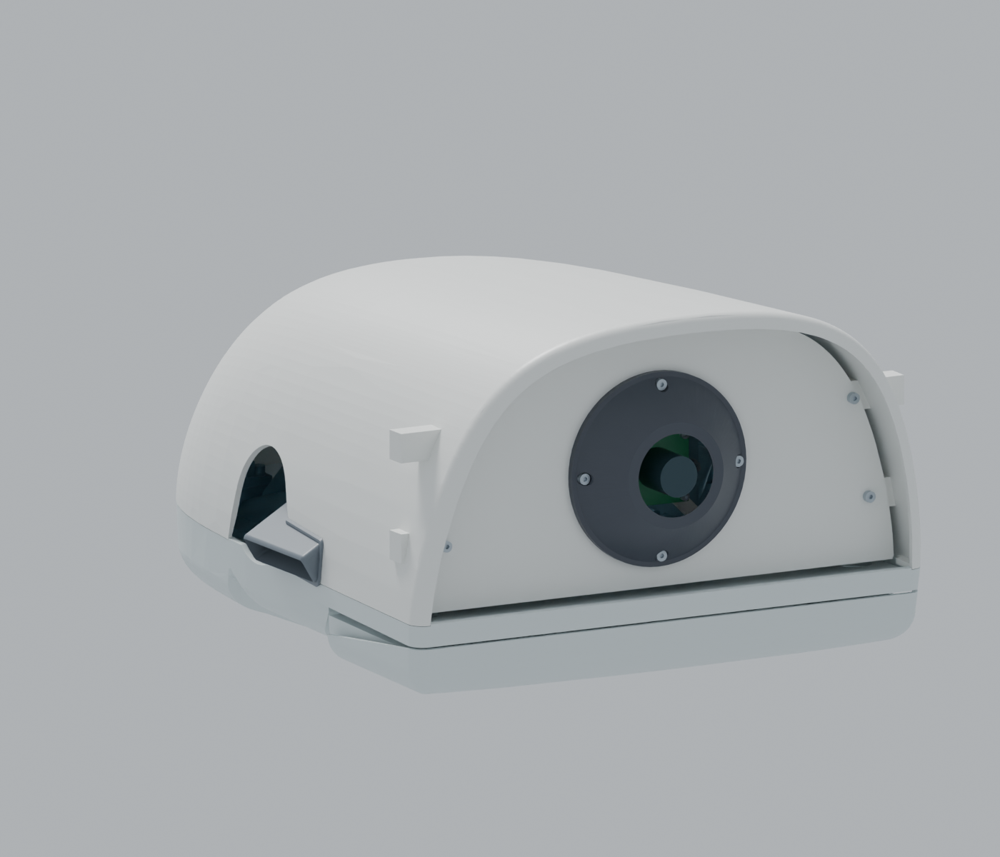

# R24 · Microduck 风格头部摄像头前盖

[完整R24 Blender模型](https://github.com/ldcyes/OpenDuck/releases/download/r24-head-camera-cover-20260923/Microduck-R24-head-camera-cover.blend) · [R24工程增量包](https://github.com/ldcyes/OpenDuck/releases/download/r24-head-camera-cover-20260923/R24-head-camera-cover-design.zip) · [3页尺寸与装配图](documents/dimensions-and-assembly.pdf) · [BOM](documents/BOM.csv)

打印主文件：[前盖与相机支架](print/front-face-camera-carrier.3mf)、[黑色镜头圈](print/black-camera-eye-bezel.3mf)、[新版上头壳](print/top-head-shell-with-lugs.3mf)。各1件，原始编号与摘要见[来源映射](source-mapping.json)。只有这3件为打印交付物。

下文中的原始文件路径对应工程ZIP；源码复算需[R23完整工程](https://github.com/ldcyes/OpenDuck/releases/tag/r23-integrated-power-design-20260922)。Blender模型可以独立打开。相机线缆末端和首件验收未闭合，因此仍是预发布。

在 R23 整机上增加可拆前盖、黑色镜头圈、相机背部支座与四个头壳安装耳。前脸沿用原 Microduck 的轮廓，保留本项目已采用的 R0×2.1 比例；头部外包络没有整体放大。原未使用的 ToF 位置封闭，不虚构额外传感器。

**这是工程设计候选，尚无实物样机或制造放行。** 摄像头插头和线缆末端、背面支承平整度、镜头入口瞳和实际视野仍须首件核对。R23 的电气、热、实测扭矩和行走未决项继续保留。

## 文件与查看

- `visual/Microduck_R24_摄像头前盖.blend`：完整静态装配，1225项装态几何/包络、17项隐藏服务参考。场景01看整机，场景02看头部；Outliner可逐件选择、隐藏PCB/电机/结构。它不是新行走动画。
- `R24_前盖尺寸与装配.pdf`：3页安装尺寸、剖面、装配顺序和首件验收要求。
- `BOM.csv`：打印件和采购五金的数量、尺寸要求。
- `geometry/`：3MF为三个打印件主文件，PLY为同拓扑分析副本。其余STL是五金/相机包络或耳座审计工具，**不能全部发送打印**。
- `assembly_selection.json`：R24完整装配清单；`manifest.json`说明新增/替换关系及原始来源。
- 各项`*_check*.json`、`contact_review.json`、`mass_delta.json`、`shell_surface_audit.json`保存计算证据和范围。

只打印以下三件，每件1个，建议PA12 SLS：

1. `R24_Microduck_front_face_camera_carrier.3mf`：前盖和相机支架一体。
2. `R24_black_camera_eye_bezel.3mf`：黑色镜头圈。
3. `R24_top_head_shell_front_cover_lugs.3mf`：替换R23上头壳，安装耳已连成一个实体。

摄像头仍是 Waveshare OS05A10 5MP USB Camera(A)，SKU33123。供应商给出的25×25mm、21mm孔距、Ø14镜头等只构成尺寸包络，不代表已拿到完整供应商CAD。四颗M1.6×14穿过四个安装孔；须核对背面支承区是否有元件，不得用螺钉把板强行压平。没有新增光学玻璃。

## 检查结果与边界

- 新增37项、替换旧上头壳1项，保留1188项。对完整1225项装态模型进行44,622个新增相关静态配对筛查；31条软线束仅为HOME姿态，不代表实际弯曲。
- 原步态9773个记录区间中的43,475个刚体配对已完成检查，包括29,970个动态配对；没有动态未证配对。32对同刚体装配贴合和12对螺纹表示逐对记录。此检查证明指定轨迹的名义几何分离，**不表示所有间隙达到2.2mm或实物行走通过**。
- 独立检查嘴部0–25°：新增前盖/耳座/五金对5个嘴部实体共200对，采用采样距离扣除连续旋转位移上界，最低名义连续间隙下界4.7496mm。旧壳与旧嘴之间的约1.4mm间隙未因此解决；该角度也不是电机软件限位批准。
- 前盖下沿和边缘已修整：发现的“装好不撞、向前抽出却卡壳”已消除。拆下4颗前盖螺钉、断开USB后，检查0–40mm向前抽出路径；实际插头及线缆操作仍待核对。
- 96°是**对角**视场。按50°半角、入口瞳后退4mm、轴向公差0.4mm和偏心0.5mm的假设进行包络检查，无壳体遮挡。真实入口瞳与画面边角须实测，不能直接保证无暗角。
- 12处正面驱动工具通道已检查；相机应先安装在拆下的前盖上，再装黑色镜头圈。裸上头壳先侧装M2螺母，然后装其余头部组件。后侧反扳工具和完整相机插拔动作仍需首件试装。
- 原上头壳的共面三维布尔差集出现负体积，未将其裁零或作为零切除证据。独立以保留三角面、双向平面多边形覆盖核对：四个声明耳座区域之外的表面保持一致，最大未覆盖残差小于0.000001mm²（平面距离容差0.00001mm）。详见`audit_shell.py`及报告。
- 三个打印主文件均单体、闭合、绕向一致；3MF/PLY读回的顶点与拓扑一致。保存后的Blender另行读回，核对1225项装态与17项服务参考的位置及来源。

## 质量与重心

PA12取0.93g/cm³，五金取7.9g/cm³，仅作工程估算。已扣除旧上头壳，沿用原15g“相机及随附线缆”一次，两个相机显示包络不会再重复计重。

最终净增重约47.90g，整机估算4.44731kg；重心相对R23前移约1.45mm、上移约2.67mm。相机/随附线缆重心仍是未实测的分布假设。新增质量产生的俯仰重力矩增量约0.064N·m（HOME参考），**没有重新批准新质量下的电机连续扭矩、步态、平衡或续航**。

## 复算与来源

这是叠加在[R23完整工程](https://github.com/ldcyes/OpenDuck/releases/tag/r23-integrated-power-design-20260922)上的独立修订；原R23发布未修改。完整Blender可直接打开，源码复算需将本包按原路径叠加至R23工程目录。先检查文件SHA256，再运行`build.py`、静态/细节/拆装检查；区间检查调用原R23包装器并使用R24的`rigid_inputs.json`，输出必须新建目录，不能覆盖冻结结果。采用Python、NumPy、trimesh、manifold3d、Matplotlib及Blender4.5；分析坐标单位mm，Blender场景单位m。

打印件由网格源派生，因此交付的是3MF和索引PLY，不冒充参数化STEP实体。原始轮廓、来源清单和供应商尺寸图随包保留。原模型来源是[Pollen Robotics Microduck](https://github.com/pollen-robotics/microduck_rl)固定快照；沿用项目NOTICE及原模型非商业许可限制，不额外授予商业许可。相机尺寸来自[Waveshare官方产品页](https://www.waveshare.com/OS05A10-5MP-USB-Camera-A.htm)。
