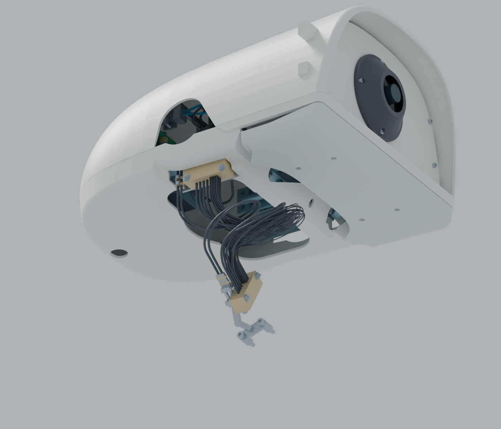

# OpenDuck R25：头部底部接线

[完整R25 Blender](https://github.com/ldcyes/OpenDuck/releases/download/r25-bottom-head-entry-20260923/OpenDuck-R25-bottom-head-entry.blend) · [工程增量ZIP](https://github.com/ldcyes/OpenDuck/releases/download/r25-bottom-head-entry-20260923/R25-bottom-head-entry-design.zip) · [尺寸与装配图](documents/dimensions-and-assembly.pdf) · [两件打印主文件](print) · [桥架STEP](machining/bottom-entry-bridge.step)

ZIP叠加[R23工程](https://github.com/ldcyes/OpenDuck/releases/tag/r23-integrated-power-design-20260922)和[R24工程](https://github.com/ldcyes/OpenDuck/releases/tag/r24-head-camera-cover-20260923)使用；Blender可独立打开。下文相对路径对应ZIP工程根目录。

本版将31根跨颈部导线从头部侧面入口改为底部入口，保留R24摄像头前盖及整机比例。上头壳恢复原型侧面壳面，原有电机工作孔保留；该孔不再作为线束入口。当前为工程设计候选，未制造、未上电、未放行运动。

## 实际改动

- 新上、下头壳：上壳关闭旧31线专用窗口，保留R24四个前盖安装耳；下壳新增底部导向孔和桥架让位口。两件均提供毫米单位3MF打印主文件及双精度PLY，经过拓扑与坐标回读。
- 上导向座：自由出口基准为HOME坐标 **(32, −68, 198) mm**，固定侧朝+Z、自由侧朝−Z。PEEK梳形孔、VMQ夹持件、压盖、P5/P6衬片及绑带整体重新定向。
- 新6061桥架：保留原头内承载梁夹座、17mm孔距、M2紧固件及原正向限位环，重新设计绕过承载板、螺钉和线束的连接臂。下导向座位置不变。
- 31根头内固定尾线：重新布置入口段，保留原电气端点、端子定义和原有末端细节；P1–P4的剥线/焊接材料边界保留，不用整根绝缘圆管代替焊点。
- 31根活动线：采用统一缩短到旧长度82%的收拢方案，自由段约200–223mm，两根P5/P6电源线并入主束旁。HOME横向范围由保守长线方案约171mm缩至106mm；保留导线身份、端点和物理长度约束。模型里是HOME形状，不刚性绑定到头部，也不代表布线动力学仿真。端点、物理长度与导向内部长度归属集中见`routing_contract.json`。

## 文件与查看

`visual/OpenDuck_R25_底部走线.blend` 是完整装配，能够独立打开。场景01为整机、02为摄像头前盖、03为底部接线；在Outliner中逐件选择/隐藏。显示颜色是部件识别色，实际线色仍按端号表。服务参考默认隐藏且不重复计重。

所选活动线唯一入口为`flex/compact_bundle_home/manifest.json`；`flex/selected_home`、`home_geometry`及其他候选仅为过程对照，不得混装。

`assembly_selection.json` 是装配选择清单；`mechanics/manifest.json`、`tails/manifest.json`及所选自由线路清单指定零件来源。不要混用早期诊断线束，尤其不能用只按HOME最短路径生成的长度剪线。`R25_头部底部入口与装配.pdf`给出入口、固定接口和装配顺序；`Complete_Conductor_Lengths_R25.json` / CSV保留59线总表，31条随新走线更新，仍为未放行的裁线候选。

本增量包叠加R23完整工程与R24前盖工程使用，所有路径相对于同一个工程根目录。Blender不需要这些外部依赖。R23/R24历史包不改写。

## 已核查的范围

- 静态使用全部新实体和全部保留装配实体，包含完整自由线束与固定尾线。螺纹接合、软夹持面和绑带结头按具体配对记录；部分三角网格接触通过原生STEP二次核实，不能将所有重叠统一忽略。
- 新刚体对记录步态的66,348个配对、9,773个关节区间进行了检查，其中46,170个动态配对没有未解决项。该轨迹中头部变化很小，不能代替大角度转头；自由线束不参与刚体绑定检查。
- 新导向/桥架/固定尾线对嘴部0–25°几何扫掠的连续间距下界为4.719mm。整机旧下壳在约8.75°开始与旧嘴部承载件相交，另有旧壳/嘴窄间隙未获连续裕量；本版没有批准25°嘴部工作行程。
- 工具通道以明确的装配阶段检查：先在台架上穿入直线、未端接的导线，紧固压盖，再成型和端接；导向座及桥架在头部连接颈部、安装上下壳之前固定。不能在整机闭壳后照搬这些工具通道结论。
- 最终短线按HOME及颈俯仰±10°、头俯仰±15°、偏航±30°、侧倾±10°的单轴端点逐一检查，嘴保持0°；这是9个离散姿态，不等于同时组合四轴、姿态之间连续变形或真实弹性平衡的证明。全族最小名义线间距下界仅约0.0161mm、最大长度残差约0.00265mm；前者不足以作为制造公差裕量，必须在实物夹持、线束回弹和磨损试验后重新定型。
- 单件STEP有效性、打印3MF/PLY的单实体闭合拓扑、完整Blender逐件坐标和来源均回读检查。详细数据和最终自由线姿态范围见`delivery_verification.json`及其引用报告。

## 首件仍需验证

密集导线的名义间距不等于制造裕量。须实际测量夹持、摩擦、反复转头磨损和温升，逐线核对端号与线长。沿用单根5N、同一时刻总束不超过5N的拉力验证方案；滑移≤0.2mm且绝缘无损。实际材料、加工公差、夹紧力与导线回弹必须由首件确认。

本版没有重新批准整机扭矩、续航、正常步速行走、相机实际图像或训练策略；R23的温升测点、旧电机接口、低电量持续驱动及动态平衡未闭合项继续保留。质量为材料和最大线密度工程估计，不是实测称重。本版约4.447479kg，相对R24净增约0.170g，HOME重心变化约(−0.112,+0.133,−0.225)mm；不据此宣称动态平衡已经验证。
