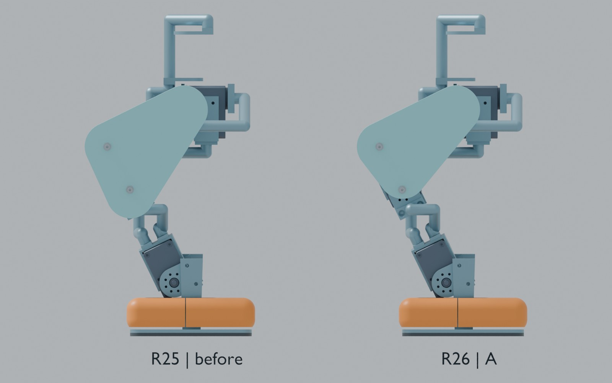
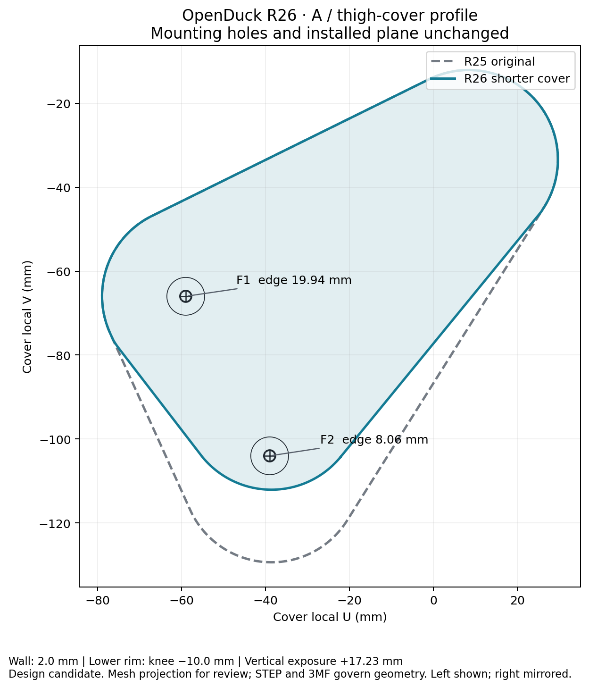

# OpenDuck R26：A方案大腿覆盖件

[English](README_EN.md) · [Blender](https://github.com/ldcyes/OpenDuck/releases/download/r26-cover-first-20260924/OpenDuck-R26-cover-first.blend) · [ZIP](https://github.com/ldcyes/OpenDuck/releases/download/r26-cover-first-20260924/R26-cover-first-design.zip) · [SHA256](https://github.com/ldcyes/OpenDuck/releases/download/r26-cover-first-20260924/SHA256SUMS.txt)

按已选A方案，缩短两侧大腿罩下缘，保持实际腿长、15个关节、商品电机、支架及固定五金的位置。**工程候选，未制造或实物验收。**

下缘从膝轴下约27.23 mm收至10.00 mm，恢复约**17.23 mm**垂直露出量。2 mm主壁、两个安装孔、定位沉孔和OD9垫圈承压台保留；固定孔中心到新外缘最小**8.056 mm**。新零件是原覆盖件的实体子集，四处工具外伸通道已检查。此处不将孔边距和主壁数值称为已通过实物受载验证。

## 下载与装配

- [两件打印主文件3MF](print)、[原生STEP](step)、[STL毫米](stl)、[轮廓尺寸PDF](documents/R26-cover-profile.pdf)。3MF是打印主文件；STEP用于原生实体核对。STL没有内置单位，导入必须选毫米，禁止自动缩放。
- 完整Blender可独立打开：场景01完整R26，02/03为同尺度新旧比较，04/05保留R25头部细节，06保留原R25参考。完整装配仍有1224项几何和17项隐藏服务参考，不能等同制造BOM零件数。Outliner可逐件选择、隐藏PCB、电机和结构。
- 装配仅替换原`R18P_L/R_thigh_photo_triangle`两件。既有支架不拆改；在无载台架、断电状态下，先卸外侧两颗M2.5×8螺钉与OD7垫圈，再沿各侧向外法线脱离定位凸台。新罩对准原定位点，依原顺序放回垫圈和螺钉。实际紧固扭矩、打印孔径/收缩与夹持力仍须首件确认；不在本次新增未经来源验证的紧固扭矩。
- ZIP是工程增量：叠加R23/R24/R25完整工程到相同根目录；执行入口位于`work/r26-cover-first/`。单独Blender和本目录的STEP/3MF不依赖旧工程才能打开。

## 已完成的检查

- 新旧原生实体、STEP在独立进程读取后的差分，以及独立网格核对均有记录。共面构造首次暴露出跨进程布尔异常，现已通过仅修改裁切工具消除；重新读取原始STEP后验证，未通过放宽体积阈值绕过。
- 两个新件原生实体有效、单实体；导出网格闭合、定向一致。完整固定支承R7区域、OD9承压台及沉孔区域均无丢失材料。打印格式回读与体积/包络误差有逐项记录。
- 对每个新罩筛查全部其它1223项所选几何，精查12个邻近配对。名义安装面接触按具体配对记录。工具通道是最终装盖阶段直径3 mm、外伸35 mm的杆部空间；不包含真实手柄、握持或批头配合的实物认证。
- 两盖原生实体子集、其所属连杆变换不变，其它部件不变，因此在相同关节姿态下不会新增刚体相交。这是连续姿态的**碰撞增量证明**，不是整机旧冲突已消除，也不代表载荷变形、制造公差、实际线束运动或真实步态通过。
- 1222项保留装配记录及15个关节记录未变。完整Blender另经新进程回读，核对真实来源、坐标与替换关系。

## 质量、侧向内收与边界

两盖合计减重约**4.420 g**；整机工程估计质量**4.443060 kg**。HOME重心变化约(+0.0337, -0.0016, +0.1428) mm。原质量账扣除两盖一次，新盖计入一次。这是材料密度估计，不是称重结果；不据此宣称动态平衡改善。

本次没有实施4 mm侧向内收：原定位凸台只进入0.8 mm，直接内移会改变支承面及螺钉堆叠，需要另做桥架结构。保持原安装面完成下缘优化，不增加连杆力臂或整体高度。模型HOME高约570.393 mm；不同站姿高度随关节角变化。

头部左侧开孔永久闭合B方案仍待独立实施，本R26仍保留R25头壳，不能据新腿图认为头孔已封。R25旧下壳与嘴部约8.75°起的冲突、线束离散姿态/公差限制、低电量持续扭矩、热、续航与实物行走未验收项继续保留。**不发布新电机采购定型、训练权重或装机运动许可。**

## 证据

[原生几何与打印回读](verification/geometry_checks.json) · [整机与工具/碰撞增量](verification/verification.json) · [质量重心](verification/mass_delta.json) · [Blender回读](verification/Blender-readback.json) · [制造及验证源程序](sources)

