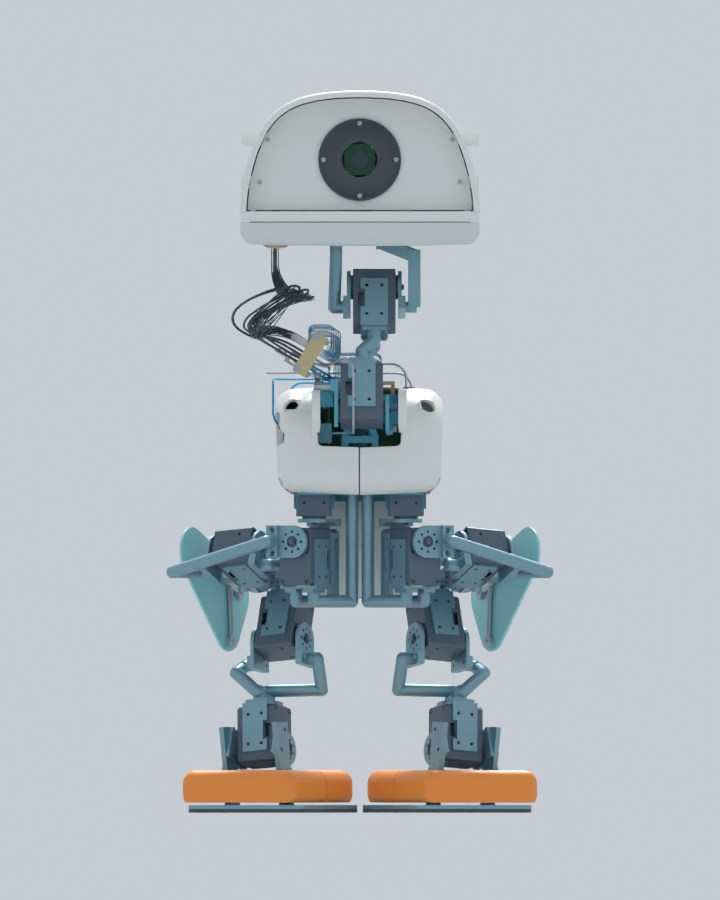

# OpenDuck R27: four-step R26 motion replay

[简体中文](README.md) · [R26 covers and complete static assembly](../r26-cover-first/README_EN.md)

This release drives the complete R26 assembly with the recorded R21 free-base numerical trajectory: 195.44175 seconds, four steps and 9,774 saved poses. The Blender scene contains 1,224 selectable assembly geometry entries. The video shows the motion at about 24× speed. **This is a motion replay on R26 geometry; dynamics were not re-solved for R26 mass.**

[Interactive Blender](https://github.com/ldcyes/OpenDuck/releases/download/r27-r26-four-step-replay-20260925/OpenDuck-R27-R26-four-step-replay.blend) · [Four-step video](https://github.com/ldcyes/OpenDuck/releases/download/r27-r26-four-step-replay-20260925/OpenDuck-R27-R26-four-step-preview.mp4) · [Engineering evidence](https://github.com/ldcyes/OpenDuck/releases/download/r27-r26-four-step-replay-20260925/R27-walk-replay-evidence.zip) · [SHA256](https://github.com/ldcyes/OpenDuck/releases/download/r27-r26-four-step-replay-20260925/SHA256SUMS.txt)

In Blender, select scene `07_R27_R26四步运动回放` and play or scrub the timeline. The original R26 static and comparison scenes remain available. The replay uses recorded free-base and 15-joint states.

The two R26 covers were subsequently checked directly over the integration intervals. See the [R28 interference review](../r28-r26-interference/README_EN.md). Its smallest conservative clearance bound is only 0.015 mm and does not meet the 2.2 mm manufacturing target.

Both new R26 thigh-cover STEP solids are subsets of the old covers. The earlier continuous rigid-body check covered 57 dynamic pairs per old cover across 9,773 integration intervals, with no unresolved dynamic penetration for those pairs. The other 1,191 rigid parts and joint transforms are unchanged. Thus the same trajectory cannot introduce a new rigid intersection through the shortened covers. The 110 named inherited installation contacts retain their individual classification; this does not prove the robot is free of conflicts in all poses.

The 31 free-neck harness pieces were excluded from that rigid interval check. Their movement in this video is a display approximation and cannot establish flexing-wire clearance. The existing mouth/lower-shell conflict beginning around 8.75° remains; mouth command is 0° in this four-step trace.

The R21 dynamics model mass was 4.195094 kg, while the R26 structure estimate is 4.443060 kg, a difference of about 247.97 g. Previous contact, torque and stability results do not qualify R26 dynamics. A new solve using measured R26 mass, inertia, battery voltage, flexible wiring and floor contact, followed by bench and physical walking tests, remains necessary. **This release does not authorize powered walking.**

[Trajectory and collision evidence](verification/analysis.json) · [Blender keyframe and position readback](verification/readback.json) · [Build and verification programs](sources)
