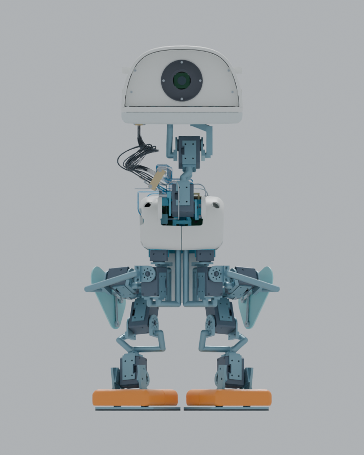

# R29：R26 装配的干涉与动力学复核

[English](README_EN.md) · [R28 问题记录](../r28-r26-interference/README.md) · [R26 原装配](../r26-cover-first/README.md)

这是**工程候选**，尚无实体样机。R29 选择保持 R26 的 1,224 项装配和 15 个关节，以一件新下头壳和四片 PEEK 出线防磨唇边替换五件旧件；腿罩、电机、原 6061 线束桥和安装坐标不变。[完整替换清单](verification/assembly_selection.json)与[源文件哈希映射](../../provenance/r29-source-mapping.json)可供逐项核对。[可交互的完整 Blender 模型](https://github.com/ldcyes/OpenDuck/releases/download/r29-r26-closure-candidate-20260929/OpenDuck-R29-R26-mass-motion.blend)包含静态装配及按 R29 估算质量重新积分的四步回放；[回读记录](verification/blender_readback.json)核对了 1,224 件、五件新网格以及动画首尾姿态。

| 问题 | 本次结果 | 尚未证明的条件 |
|---|---|---|
| 右大腿罩与左踝电机 | 在 R29 质量重算的四个慢速数值工况中，指定配对的保守名义间隙下界分别为 **11.7228 / 11.6690 / 11.7172 / 11.4071 mm**；每个工况的 9,773 个输出区间均由 12 张证书覆盖。[名义证书](verification/cover_motor_r29_final_10mm_certificate.json)及[四工况分配表](verification/cover_clearance_acceptance.md) | 分配的 6.0 mm 制造/安装/受载闭合预算未经首件测量。若每项均达标，四工况最坏剩余下界 **5.4071 mm**，高于 2.2 mm 目标。此证明只限该配对及所列四条慢速轨迹；[分配表](verification/cover_clearance_acceptance.md)不是整机无干涉证书。 |
| 下头壳与嘴部载体 | 旧件约 8.75° 开始真实穿透。新 PA12 [3MF 打印母版](mechanics/R29_lower_head_shell_mouth_10deg_3mm.3mf)和运行时 0–10° 限位给出**名义连续角域 ≥3.0581 mm** 的保守下界；[扫掠和安装复核](verification/FINAL_MOUTH_REVIEW.md)未见新增 HOME 刚体穿透。 | 对 2.2 mm 制造目标只剩 **0.8581 mm** 总闭合预算；机械硬止挡、实际过冲、螺母座载荷和公差堆栈均未验证。旧 12° 指令/标定已由 [RK 运行时](../../software/r8/rk_runtime/microduck_rk/motion_limits.py)拒绝。 |
| 31 根活动颈部线束 | 四片 [PEEK 唇边](verification/WEAR_LIP_REVIEW.md)各覆盖金属桥出线口外 1.5 mm。九个原姿态的 1,116 组唇边/线材与 42,804 组唇边/刚体筛查未见新增穿透；对 81 个组合端点姿态均进行有界求解，其中 **59 个**得到完整线形并通过 111,125 组近邻实体筛查。 | **22 个组合姿态仍未解**；最小已拟合线间距仅 **0.0161 mm**。59 个线形只是几何见证，未证明真实弹性平衡、连续过渡、磨损或 5 N 夹持。[81 姿态报告](verification/COMBINED81_REVIEW.md)与[验收步骤](verification/HARNESS_REVIEW.md)列出限制。 |
| R26/R29 行走动力学 | 按 R26 原质量 **4.443060 kg**及最终 R29 五件替换后估算质量 **4.442729 kg**，分别重算名义、半步长、μ=0.5 和九接触点四工况。R29 数值轨迹持续 **195.44 s**，双脚各前进两步，身体滚转峰峰值约 **33.38°**；足中段 20–80% 未见 >2 N 接触。[汇总](verification/R29_dynamics_validation.json)与[摆脚接触审计](verification/swing_contact_audit.json)保留全结果。 | 数值步数/轨迹阈值通过**不等于现行整机控制约束通过**。左髋横滚峰值 **0.85955 Nm**，对未实测的 0.9 Nm 上限仅有 **4.49%** 余量；15% 目标要求低电量 10.30–10.35 V、40°C、7,200 s 实测持续能力至少 **1.01124 Nm**。右髋横滚、右膝、左髋俯仰也需要相应实测能力。 |

**当前运行阻断：**现行 RK 软件嘴部结构扭矩上限为 **0.05 Nm**，而 R29 数值模型在闭嘴保持时约需 **0.0567 Nm RMS**，四工况峰值最高约 **0.05925 Nm**。MuJoCo 曾以 0.08 Nm 假设上限完成轨迹，这不能作为现行 0.05 Nm 结构限值的通过证明。必须经明确的减矩/承载结构设计与复算解决，或把嘴部锁定并重新验证；不得直接放大软件限值。[双扭簧解析与线圈空间研究](studies/mouth-counterbalance/README.md)显示潜在减矩路径，但完整弹簧腿、固定点和受力安装尚未设计放行，也**没有**装入本版装配。

制造与实物验收顺序：先按源文件哈希制造并扫描 3MF 下头壳与四片 STEP PEEK 唇边，测装配/受载/温度的实际间隙和嘴部过冲；逐根核对 31 根线的长度、绝缘、夹持、弯曲及 81 姿态连续运动，完成 10,000 次初始循环；在限流台架测嘴部及腿部电机低电量持续扭矩；然后吊架标定、受载测试，最后才进行地面步行。任一门槛失败就修改设计并重新复算。R29 没有制造、样机上电或实物行走批准。

下载：[R29 工程与证据包](https://github.com/ldcyes/OpenDuck/releases/download/r29-r26-closure-candidate-20260929/R29-engineering-evidence.zip) · [完整 Blender 模型](https://github.com/ldcyes/OpenDuck/releases/download/r29-r26-closure-candidate-20260929/OpenDuck-R29-R26-mass-motion.blend) · [SHA256](https://github.com/ldcyes/OpenDuck/releases/download/r29-r26-closure-candidate-20260929/SHA256SUMS.txt)。历史 R28 报告仍描述**修复前**的 R26/R25 几何，不应和 R29 新件混用。
